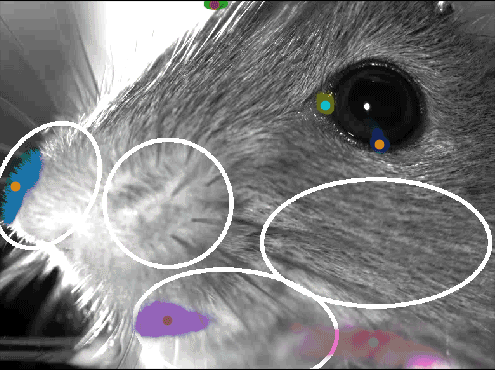

# MouseFlow

## Description
A Python toolbox to quantify facial and bodily movement in headfixed mice.


## Installation
- Compile OpenCV with CUDA capabilities: https://gist.github.com/raulqf/f42c718a658cddc16f9df07ecc627be7
- Install DeepLabCut
- (Optional:) Install Deepgraphpose (DLC2 compatible) from https://github.com/lnguyen/deepgraphpose/tree/upgrade using pip install
- To install MouseFlow:
```
pip install git+https://github.com/obarnstedt/MouseFlow
```

## Workflow
At this point, MouseFlow contains two main functions: runDLC() and runMF().

### Face/body labelling using pre-trained models
runDLC(models_dir, vid_dir, facekey, bodykey) will find face and body videos in a directory of choice (vid_dir) and apply pre-trained DeepLabCut models (either present or automatically downloaded into 'models_dir') on these videos.

### Kinematics and optical flow extraction
runMF(dlc_dir) runs across the resulting marker files and automatically saves data frames including, among others, the following data:
* Pupil diameter (extracted based on circular fit of 6 pupil markers)
* Eye opening (based on distance of upper and lower eyelids)
* Face regions (automatically segmented based on facial landmarks extracted from markers)
* Motion energy for each face region
* Optical flow angle and magnitude for each face region (extracted using Farneback dense optical flow)
* Whisking & sniffing frequency and phase
* Paw movement, stride frequency, gait information (based on kinematics of paw markers)
* Paw and tail angles



## Dependencies
This software relies heavily on [DeepLabCut](https://github.com/DeepLabCut/DeepLabCut/) and [OpenCV](https://opencv.org/) libraries for its functionality.

## Contributors
DLC models were trained with data from Sanja Mikulovic (LIN Magdeburg), Petra Mocellin (LIN Magdeburg), Liudmila Sosulina (LIN Magdeburg), and Falko Fuhrmann (DZNE Bonn). Code was developed together with Nick del Grosso (Bonn University).