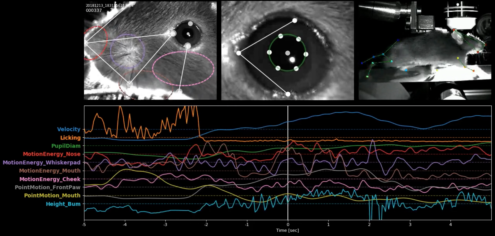

# MouseFlow

## Description
A Python toolbox to quantify facial and bodily movement in headfixed mice.



## Installation
- Compile OpenCV with CUDA capabilities: https://gist.github.com/raulqf/f42c718a658cddc16f9df07ecc627be7
- Install DeepLabCut
- (Optional:) Install Deepgraphpose (DLC2 compatible) from https://github.com/lnguyen/deepgraphpose/tree/upgrade
- To install MouseFlow:
```
pip install git+https://github.com/obarnstedt/MouseFlow
```

## Roadmap
- [x] make package pip-installable

